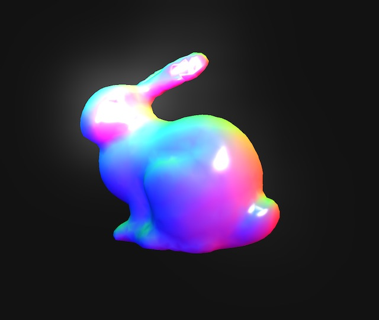

# Bloom Effect Example

> [regl](https://github.com/regl-project/regl)-based bloom effect in nearly-vanilla WebGL

## Introduction

This example performs a bloom effect in WebGL using a [separable Gaussian blur](https://github.com/Jam3/glsl-fast-gaussian-blur). To achieve a relatively smooth blur with relatively few passes, it downsamples the full-size framebuffer when computing the blur and performs blur passes of, for example, radius 32, 16, 8, 4, 2, and finally 1 pixel. That makes it not really an exact Gaussian blur, but seems to get the job done.

Please be advised that the goal here is not an optimal implementation of a bloom effect but more to present a way to implement post-processing effects like these effects in [regl](https://github.com/regl-project/regl). I hope maybe this repo is useful for someone, but don't overestimate its value. 😄  The standard if you really want to perform real-time bloom seems to be some combination of mip-maps/image pyramids and [Kawase's method](https://software.intel.com/en-us/blogs/2014/07/15/an-investigation-of-fast-real-time-gpu-based-image-blur-algorithms).

Update: I've added an FFT implementation as well which performs a full convoution and uses some sort of star pattern instead of a gaussian kernel.

[Live example](https://rreusser.github.io/bloom-effect-example/)

## License

&copy; 2020 Ricky Reusser. MIT License.
